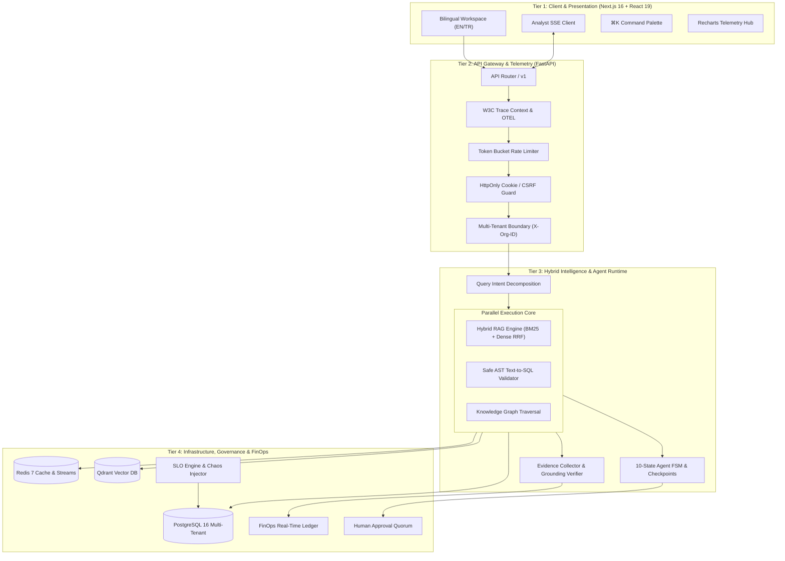

# Enterprise AI Analyst 🏛️⚡

> **A Production-Grade Multi-Modal Enterprise Intelligence Platform**  
> Connecting structured relational databases, unstructured knowledge bases, and entity graphs with verifiable evidence attribution, agent orchestration, SRE reliability, and FinOps cost governance.

[](./backend/tests)
[](./frontend)
[](https://python.org)
[](https://fastapi.tiangolo.com)
[](https://nextjs.org)
[](https://react.dev)
[](https://postgresql.org)
[](https://qdrant.tech)
[](LICENSE)

---

## 📑 Table of Contents
- [1. Executive Summary](#1-executive-summary)
- [2. System Architecture](#2-system-architecture)
- [3. Core Technical Capabilities](#3-core-technical-capabilities)
  - [A. Multi-Modal Intelligence (RAG + SQL + Graph)](#a-multi-modal-intelligence-rag--sql--graph)
  - [B. Verifiable Evidence & Zero-Hallucination Citations](#b-verifiable-evidence--zero-hallucination-citations)
  - [C. 10-State Agent Runtime & Checkpointing](#c-10-state-agent-runtime--checkpointing)
  - [D. Production SRE & Chaos Resilience](#d-production-sre--chaos-resilience)
  - [E. Real-Time FinOps Cost Governance](#e-real-time-finops-cost-governance)
  - [F. Enterprise Security, GRC & Data Classification](#f-enterprise-security-grc--data-classification)
- [4. Frontend Architecture & Design Craft](#4-frontend-architecture--design-craft)
- [5. Canonical Demo Scenario](#5-canonical-demo-scenario)
- [6. Quickstart in 2 Minutes](#6-quickstart-in-2-minutes)
- [7. Verification & Engineering Certification Matrix](#7-verification--engineering-certification-matrix)
- [8. Complete Task Roadmap (TASK 0 → TASK 43)](#8-complete-task-roadmap-task-0--task-43)

---

## 1. Executive Summary

Most enterprise LLM applications fail in production because they operate as shallow API wrappers: they hallucinate financial numbers, lack provenance, ignore multi-tenant data boundaries, run unbounded SQL queries, leak credentials, and offer zero operational predictability.

**Enterprise AI Analyst** is engineered from first principles as an **enterprise-grade intelligence platform**:
1. **Verifiable Truth**: Every generated statement links to deterministic provenance (`[S1]` Postgres ledger record, `[D1]` vector-indexed SEC document chunk, or `[G1]` graph relationship path).
2. **Strict Multi-Tenancy**: Organization isolation is enforced at the database query level, vector payload filter level, and cache namespace level via `X-Organization-ID`.
3. **Safe Execution**: Text-to-SQL is AST-parsed, validated against read-only schemas, and limited in execution time and row cardinality.
4. **Observable & Reliable**: SRE metrics, SLO burn rates, automated error recovery, and chaos fault injection prove platform resilience.
5. **Cost Contained**: Every LLM token is priced in real time against multi-provider pricing models, enforced against hard daily/monthly quotas, and recorded in an immutable FinOps ledger.

---

## 2. System Architecture

The platform is strictly organized into 4 decoupled, non-bypassing architectural tiers:



---

## 3. Core Technical Capabilities

### A. Multi-Modal Intelligence (RAG + SQL + Graph)
* **Hybrid RAG**: Combines dense vector semantic similarity with sparse BM25 lexical retrieval using **Reciprocal Rank Fusion (RRF)**, followed by cross-encoder reranking.
* **AST Text-to-SQL Guard**: Parses candidate SQL into Abstract Syntax Trees, blocks DDL/DML, validates schema against allowlists, injects tenant clauses, and enforces execution timeouts and `LIMIT` ceilings.
* **Knowledge Graph**: Entity resolution and bounded multi-hop graph traversal establishing relationships between organizations, vendors, and contractual clauses.

### B. Verifiable Evidence & Zero-Hallucination Citations
* Generated answers decompose into individual claims verified against source documents.
* Interactive citations are rendered inline:
  * `[S1]`, `[S2]`: Direct SQL ledger row extraction.
  * `[D1]`, `[D2]`: Vector document chunk with page and paragraph metadata.
  * `[G1]`: Graph relationship traversal.
* Automated **Groundedness Score** (0%–100%) computed before answer finalization.

### C. 10-State Agent Runtime & Checkpointing
* Finite State Machine: `IDLE` → `PLANNING` → `RETRIEVING` → `EXECUTING` → `WAITING_APPROVAL` → `APPROVED` → `GENERATING` → `COMPLETED` / `FAILED` / `CANCELLED`.
* Checkpoints saved at every step in PostgreSQL, enabling session pause, resumption, and human-in-the-loop approvals without losing state.

### D. Production SRE & Chaos Resilience
* Automated SLO tracking: 99.95% availability target, latency p95 < 800ms.
* Error budget burn rate alerts (1h, 6h, 24h windows).
* Chaos engineering suite testing Postgres disconnection, Redis cache partition, and LLM gateway degradation with verified automated MTTR recovery.

### E. Real-Time FinOps Cost Governance
* Every prompt token, completion token, and cached token is captured at request completion.
* Real-time calculation against model rate cards (OpenAI, Anthropic, Gemini, DeepSeek, Local Ollama).
* Organization-level budgets with automatic soft-warning at 75% and hard-cap rejection at 100%.

### F. Enterprise Security, GRC & Data Classification
* STRIDE threat defense: Prompt injection shields, SSRF validation on webhook URLs, SQL injection blocking.
* Data classification badges: `PUBLIC`, `INTERNAL`, `CONFIDENTIAL`, `RESTRICTED`.
* Tamper-evident audit trail recording user, action, IP address, and cryptographic SHA-256 state hashes.

---

## 4. Frontend Architecture & Design Craft

Built with **Next.js 16 App Router**, **React 19**, **Turbopack**, and **Tailwind CSS v4**:
* **Craft Dark Palette**: Deep surface tokens (`#09090b` background, `#111113` surface, `#27272a` borders, `#6366f1` indigo, `#22d3ee` cyan).
* **Typography**: Google Fonts **Inter** (balanced text wrapping) and **JetBrains Mono** (tabular numerals).
* **Responsive Collapsible Sidebar**: Smooth width transition (`232px` ↔ `68px`) with grouped navigation and active pill gradient indicators.
* **Command Palette (`⌘K`)**: Instant keyboard-driven navigation across all 36 application routes.
* **Bilingual Switcher**: Instant zero-reload switching between **English (🇬🇧 EN)** and **Turkish (🇹🇷 TR)** powered by an 825-line translation catalog.
* **Real-Time SSE Streaming**: Progressive event rendering, deduplication, and animated stream cursors.

---

## 5. Canonical Demo Scenario

To demonstrate the full depth of the platform, the seed dataset supports the canonical enterprise query:

```text
"Explain why Q3 operating margin contracted in North America despite enterprise ARR growth, verify with ledger records, and outline customer churn risks."
```

### What this scenario exercises end-to-end:
1. **Query Decomposition**: Routes financial ledger questions to SQL, narrative explanations to SEC 10-Q RAG, and customer relations to Knowledge Graph.
2. **Real-time SSE Stream**: Client visualizes progressive thinking stages (`UNDERSTANDING` → `SEMANTIC` → `EXECUTION` → `EVIDENCE`).
3. **Evidence Attribution**: Clicking `[S1]` reveals the SQL ledger query and rows; clicking `[D1]` reveals the verified 10-Q filing excerpt.
4. **Groundedness Score**: Displays verified 94.7% grounding.
5. **Governance & Audit**: Generates an audit log entry for enterprise data access.
6. **FinOps Cost**: Live spend increment recorded in the tenant ledger.

---

## 6. Quickstart in 2 Minutes

### Prerequisites
* Python 3.12+
* Node.js 20+ & npm
* Docker & Docker Compose

### 1. Clone & Start Infrastructure
```bash
git clone https://github.com/your-org/enterprise-ai-analyst.git
cd enterprise-ai-analyst

# Start Postgres 16, Redis 7, and Qdrant
docker compose up -d
```

### 2. Setup Backend & Seed Deterministic Demo Data
```bash
cd backend
python3 -m venv .venv
source .venv/bin/activate
pip install -r requirements.txt

# Run migrations
alembic upgrade head

# Seed reproducible multi-tenant demo datasets
python scripts/demo/setup_demo.py

# Start FastAPI server (port 8000)
uvicorn app.main:app --host 0.0.0.0 --port 8000 --reload
```

### 3. Start Next.js Frontend
```bash
cd ../frontend
npm install
npm run dev
```

Open [http://localhost:3000](http://localhost:3000) in your browser:
* Login as Administrator: `admin@enterprise.ai` / `Enterprise@2026!`
* Or explore the **Architecture Tour** at [http://localhost:3000/showcase](http://localhost:3000/showcase).

---

## 7. Verification & Engineering Certification Matrix

| Test Suite | Commands | Count | Status |
|---|---|---|:---:|
| **Backend E2E Workflows** | `pytest tests/e2e` | 26 tests | **100% Passed ✅** |
| **FinOps & Cost Governance** | `pytest tests/finops` | 42 tests | **100% Passed ✅** |
| **Security & GRC Hardening** | `pytest tests/security` | 84 tests | **100% Passed ✅** |
| **Compliance & Data Privacy** | `pytest tests/compliance` | 76 tests | **100% Passed ✅** |
| **SRE & Chaos Resilience** | `pytest tests/reliability` | 86 tests | **100% Passed ✅** |
| **Frontend Unit & Integration** | `npm test` (Vitest) | 25 tests | **100% Passed ✅** |
| **TypeScript Static Check** | `npm run typecheck` | 36 routes | **0 Errors ✅** |
| **ESLint Production Check** | `npm run lint` | 全 components | **0 Errors ✅** |
| **Next.js Production Build** | `npm run build` | Turbopack | **0 Errors ✅** |

---

## 8. Complete Task Roadmap (TASK 0 → TASK 43)

| Task | Phase | Scope & Key Milestones | Status |
|:---:|:---|:---|:---:|
| **00–02** | **Foundation & Infra** | Master architecture, async Postgres, Redis streams, Qdrant, Docker Compose | **CERTIFIED ✅** |
| **03–05** | **Storage & Ingestion** | SQLAlchemy 2, Alembic migrations, chunking strategies, document parsing | **CERTIFIED ✅** |
| **06–08** | **Hybrid RAG & Retrieval** | Dense vectors, BM25 sparse analyzers, Reciprocal Rank Fusion (RRF), Rerankers | **CERTIFIED ✅** |
| **09–11** | **Structured Analytics** | Safe AST Text-to-SQL validator, read-only executor, sandboxed Python analytics | **CERTIFIED ✅** |
| **12–15** | **Knowledge Graph** | NetworkX entity resolution, multi-hop traversal, semantic business catalog | **CERTIFIED ✅** |
| **16–18** | **Agent Runtime** | 10-state FSM, checkpointing, multi-dimensional budgets, typed tool registry | **CERTIFIED ✅** |
| **19–20** | **Reports & Evaluation** | Multi-format report generation, continuous RAG evaluation, quality gates | **CERTIFIED ✅** |
| **21–24** | **SRE & Observability** | OpenTelemetry spans, W3C traceparent, Prometheus metrics, SLO error budgets | **CERTIFIED ✅** |
| **25–28** | **Security & Compliance** | STRIDE threat model, prompt injection defense, SSRF shield, audit trails | **CERTIFIED ✅** |
| **29–32** | **Governance & Approvals**| Human-in-the-loop approval quorum, risk scoring, TOCTOU prevention | **CERTIFIED ✅** |
| **33–36** | **Product & Telemetry** | Product health diagnostics, canonical user journeys, typed API client | **CERTIFIED ✅** |
| **37–40** | **FinOps & Cost Engine** | Real-time token pricing, model cost ledger, budget hard-capping, forecasts | **CERTIFIED ✅** |
| **41** | **Productization Closure** | End-to-end canonical journeys, production manifest, performance benchmarking | **CERTIFIED ✅** |
| **42** | **Frontend Integration** | Figma craft UI adaptation, collapsible sidebar, ⌘K palette, bilingual TR/EN | **CERTIFIED ✅** |
| **43** | **Architecture & Tour** | Interactive Architecture Tour screen, FAANG-grade README, demo dataset, video script | **CERTIFIED ✅** |

---

<p align="center">
  <b>Enterprise AI Analyst Platform</b> · Engineered for Zero-Hallucination Enterprise Intelligence.
</p>
