# Enterprise AI Analyst — Master Architecture Specification

> [!IMPORTANT]
> **Architectural Status**: Internal Architecture Review: **PASSED** (Production Candidate).
> **Billing Boundary Disclaimer**: Internal usage accounting and cost estimation only; not an external billing gateway.

---

## 1. System Context & Component Architecture

The Enterprise AI Analyst platform is engineered as a unified, audit-grade, multi-tenant intelligence layer that transforms enterprise raw unstructured data, transactional databases, and corporate knowledge graphs into grounded, provable analytic insights.

```mermaid
flowchart TB
    subgraph Clients["User & Client Layer"]
        Browser["Next.js 16 Web Dashboard\n(App Router + Turbopack)"]
        API_Client["API Consumer / CLI / SDK"]
    end

    subgraph Edge["Gateway & Security Boundary"]
        ReverseProxy["Edge / Reverse Proxy\n(Rate Limiting, TLS, CORS)"]
        AuthN["JWT Authentication & RBAC Engine\n(138 Catalog Permissions)"]
        TenantGuard["Tenant Context Resolver\n(RLS + Multi-tenant Boundary)"]
    end

    subgraph Application["Core Application Services"]
        PlatformRouter["FastAPI Application Core\n(/api/v1/...)"]
        AnalystOrchestrator["Unified AI Analyst Orchestrator\n(RAG + SQL + Graph Fusion)"]
        AgentRuntime["Multi-Agent Runtime\n(State Machine, Checkpoints, Memory)"]
        SemanticLayer["Semantic Modeling & Text-to-SQL\n(Read-Only AST Validation)"]
        KnowledgeGraph["Knowledge Graph Engine\n(Entity Resolution, Bounded Traversal)"]
        LLMGateway["LLM Gateway & Dynamic Routing\n(Quality Floors, Fallbacks, Retry Jitter)"]
    end

    subgraph Governance_SRE["Governance, FinOps & SRE Layer"]
        GovPolicy["Governance & Human Approval Engine\n(TOCTOU Prevention, Quorums)"]
        FinOpsEngine["FinOps & Cost Governance\n(Append-Only Ledger, Versioned Pricing)"]
        SREEngine["SRE / SLO / Multi-Burn Alerts\n(Incident FSM, Automated Runbooks)"]
        ContinuousEval["Continuous Evaluation Framework\n(Grounding, Citation Recall, Quality Gates)"]
    end

    subgraph Persistence["Storage & Data Layer"]
        Postgres[(PostgreSQL 16\nRelational, RLS, FinOps Ledger)]
        RedisCache[(Redis\nDistributed Cache, Celery Broker)]
        QdrantVector[(Qdrant Vector DB\nHybrid Dense/Sparse Embeddings)]
    end

    Clients --> Edge
    Edge --> Application
    Application --> Governance_SRE
    Application --> Persistence
    Governance_SRE --> Persistence
```



---

## 2. Canonical Data Flows

### A. Document Onboarding & Ingestion Pipeline
```text
User / Connector Upload
       │
       ▼
Validation & Normalization (Magic bytes, MIME check, Virus scanner)
       │
       ▼
Document Parser (PDF, DOCX, CSV, Markdown, Multilingual extraction)
       │
       ▼
Semantic Chunking (Context preservation, metadata attachment)
       │
       ▼
Embedding Generation (Dense vectors + Sparse BM25 tokens)
       │
       ▼
Vector Indexing (Qdrant collection + Payload filtering)
       │
       ▼
Classification & Cataloging (INTERNAL, CONFIDENTIAL, RESTRICTED)
       │
       ▼
Audit Record & Event Ledger Entry
```

---

### B. Knowledge Query & Evidence Grounding (RAG Flow)
```text
Natural Language Query
       │
       ▼
Query Understanding & Decomposition
       │
       ▼
Search Planning (Intent routing, filter generation)
       │
       ▼
Hybrid Retrieval (Dense cosine + Sparse BM25 via Reciprocal Rank Fusion)
       │
       ▼
Cross-Encoder Reranking (Top-K relevance scoring)
       │
       ▼
Context Compression & Prompt Construction
       │
       ▼
LLM Gateway Dispatch (Streaming token generation)
       │
       ▼
Evidence Synthesis & Hallucination Verification Gate
       │
       ▼
Client Delivery (SSE Event stream with [S1] citations)
```

---

### C. Secure Structured Analytics (SQL Agent Flow)
```text
Natural Language Analytics Question
       │
       ▼
Semantic Layer Mapping (Metric & Dimension resolution)
       │
       ▼
SQL AST Planner (SELECT / WITH only validation)
       │
       ▼
Tenant Boundary Injection (Strict tenant WHERE clauses)
       │
       ▼
Execution Guardrails (Timeout: 5000ms, Max Rows: 1000)
       │
       ▼
Database Query Execution (Read-only transaction)
       │
       ▼
Dataframe Provenance & Analytical Summary
```

---

### D. Security & Classification Flow
```text
Incoming Request
       │
       ▼
JWT Validation & Permission Resolution
       │
       ▼
Tenant Isolation Context (TenantContext injected)
       │
       ▼
Data Classification Assessment:
  ├── PUBLIC / INTERNAL: Standard Gateway routing
  ├── CONFIDENTIAL: Masked logs, encrypted storage
  └── RESTRICTED: External LLM providers strictly PROHIBITED;
                  Routed exclusively to self-hosted models
       │
       ▼
Immutable Audit Log Entry with Cryptographic Checksum
```

---

### E. FinOps & Cost Governance Flow
```text
LLM Request Completion
       │
       ▼
Token Usage Extraction (Input, Output, Cached tokens)
       │
       ▼
Versioned Model Pricing Registry Lookup
       │
       ▼
Deterministic Cost Calculation:
  Cost = (Input * Rate_in) + (Output * Rate_out) + (Cached * Rate_cached)
       │
       ▼
Append-Only CostEvent Creation (Scrubs confidential prompts)
       │
       ▼
Multi-Dimensional Allocation (Org, Tenant, Team, Feature)
       │
       ▼
Budget & Quota Consumption:
  ├── Burn rate calculation
  ├── Warning threshold (80%)
  └── Hard stop threshold (100% -> Preflight Block)
       │
       ▼
Statistical Anomaly Detection & Spend Forecasting
```

---

### F. SRE & Incident Resolution Flow
```text
SLI Telemetry Collection (Availability, Latency, Error Rate)
       │
       ▼
SLO Monitoring & Error Budget Consumption
       │
       ▼
Multi-Window Multi-Burn-Rate Alert Evaluation:
  ├── 1h burn > 14.4 (Critical)
  ├── 6h burn > 6.0  (High)
  └── 3d burn > 1.0  (Warning)
       │
       ▼
Automated Incident Creation (State: DETECTED -> INVESTIGATING)
       │
       ▼
Automated Runbook Failover Execution (State: MITIGATING)
       │
       ▼
Health Recovery Verification (State: RESOLVED -> POSTMORTEM -> CLOSED)
```
