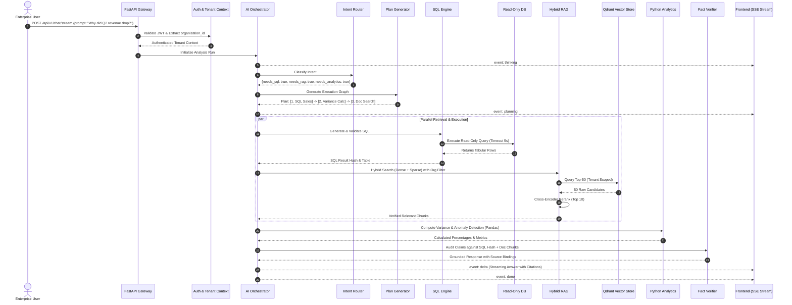

# Task 0: Enterprise AI Analyst — Backend Architecture & Technical Specification

> **Document Version:** 1.0.0  
> **Status:** APPROVED & LOCKED (Foundation Blueprint)  
> **Phase:** Architecture & Technical Design (Task 0)  
> **Next Phase:** Task 1 — Backend Foundation (Core Setup, Config, Logging, Errors, Health, Docker)

---

## 1. Product Definition & Vision (0.1)

### 1.1 Product Identity
- **Product Name:** Enterprise AI Analyst
- **Classification:** Enterprise AI Business Intelligence & Reasoning Platform
- **Core Value Proposition:** An enterprise-grade, multi-tenant intelligence system that connects structured (SQL/data warehouses) and unstructured (documents, PDFs, reports) enterprise data with LLM reasoning, advanced hybrid RAG, deterministic data analytics, and claim-by-claim evidence verification.

### 1.2 Core Platform Capabilities
1. **Data Source Connectivity:** Connect relational databases (PostgreSQL, MySQL, Snowflake) and storage backends.
2. **Document Ingestion:** Multi-format ingestion (PDF, DOCX, XLSX, CSV, Markdown, TXT).
3. **Multi-Stage Indexing:** Parsing, layout normalization, semantic chunking, and dual-vector generation.
4. **Hybrid Retrieval:** Dense semantic retrieval + Sparse keyword retrieval (BM25/SPLADE) with cross-encoder reranking.
5. **Natural Language to SQL (Text-to-SQL):** Deterministic schema linking, syntax validation, dialect translation, and read-only execution.
6. **Code-Driven Data Analysis:** Computational verification using sandboxed Python/pandas for calculations, trend analysis, growth metrics, and statistical anomaly detection.
7. **Intent Routing & Autonomous Planning:** Multi-step query decomposition and agentic workflow orchestration.
8. **Evidence Attribution & Fact Grounding:** Full traceability mapping claims to exact document chunks, page numbers, or SQL result hashes.
9. **Automated Verification:** Self-correction and evidence validation pipeline to eliminate hallucinations.
10. **Rich Analytics Output:** Chart schema generation (Apache ECharts / Vega-Lite compatible) and executive reporting.
11. **Comprehensive Observability & Cost Tracking:** Trace-level token consumption, latency breakdown, and per-tenant cost attribution.
12. **Strict Multi-Tenancy & RBAC:** Data, cache, vector index, and execution isolation per organization.

---

## 2. User Roles & Access Control (0.2)

```
┌───────────────────────────────────────────────────────────────────────────────┐
│                               USER ROLES MATRIX                               │
├─────────────────┬─────────────────┬───────────────────┬───────────────────────┤
│ Capability      │ Admin           │ Analyst           │ Viewer                │
├─────────────────┼─────────────────┼───────────────────┼───────────────────────┤
│ Org Management  │ Full            │ None              │ None                  │
│ User Management │ Full            │ None              │ None                  │
│ Data Sources    │ Connect/Edit    │ View/Query Only   │ None                  │
│ Document Upload │ Full            │ Full              │ None                  │
│ Run Analysis    │ Full            │ Full              │ Query Approved Only   │
│ Create Reports  │ Full            │ Full              │ None                  │
│ View Reports    │ Full            │ Full              │ Read Only             │
│ Audit & Usage   │ Full            │ Org Aggregates    │ None                  │
│ Settings & Keys │ Full            │ Profile Only      │ Profile Only          │
└─────────────────┴─────────────────┴───────────────────┴───────────────────────┘
```

---

## 3. System Boundaries & Scope (0.3)

```
┌───────────────────────────────────────────────────────────────────────────────┐
│                              SYSTEM BOUNDARIES                                │
├──────────────────────────────────────┬────────────────────────────────────────┤
│ IN SCOPE (MVP & Core Architecture)   │ OUT OF SCOPE (Future Extensions)       │
├──────────────────────────────────────┼────────────────────────────────────────┤
│ • Enterprise Multi-Tenancy & RBAC    │ • Video/Audio generation               │
│ • Document Ingestion & Chunking      │ • Voice Assistant (Speech-to-Text/TTS) │
│ • Hybrid Vector Retrieval + Reranker │ • Native Mobile Applications (iOS/And) │
│ • Safe Read-Only Text-to-SQL         │ • Complex Billing / Payment Gateways   │
│ • Python-based Statistical Analytics │ • External Marketplace / Integrations  │
│ • Evidence Attribution Engine        │ • Generic CRM / ERP System Replacements│
│ • Real-Time SSE Streaming            │ • Autonomous Web Scraping / Crawling   │
│ • Usage, Cost & Audit Tracing        │                                        │
└──────────────────────────────────────┴────────────────────────────────────────┘
```

---

## 4. High-Level Architecture (0.4)

### 4.1 System Topology
```
                          ┌─────────────────────────┐
                          │   Frontend Application  │
                          │   (Next.js App Router)  │
                          └────────────┬────────────┘
                                       │ HTTPS / SSE
                                       ▼
                          ┌─────────────────────────┐
                          │     FastAPI Gateway     │
                          │  (Auth, Routing, Rate)  │
                          └────────────┬────────────┘
                                       │
            ┌──────────────────────────┼──────────────────────────┐
            ▼                          ▼                          ▼
   ┌─────────────────┐        ┌─────────────────┐        ┌─────────────────┐
   │   PostgreSQL    │        │   Redis Stack   │        │     Qdrant      │
   │  (Relational DB │        │ (Cache, Queues, │        │ (Vector Engine, │
   │  & Audit Store) │        │  Rate Limits)   │        │ Hybrid Payload) │
   └─────────────────┘        └────────┬────────┘        └─────────────────┘
                                       │
                                       ▼
                              ┌─────────────────┐
                              │  Worker Pool    │
                              │ (Celery/ARQ/    │
                              │  Async Workers) │
                              └─────────────────┘
```

### 4.2 AI Orchestration Pipeline
```
User Question
     │
     ▼
[AI Orchestrator]
     │
     ▼
[Query Router] ────────► {Intent: RAG | SQL | Analysis | Hybrid}
     │
     ▼
[Planner Agent] ───────► Decomposed Execution Graph (DAG Tasks 1..N)
     │
     ├──────────────────────────┬──────────────────────────┐
     ▼                          ▼                          ▼
[RAG Agent]                [SQL Agent]             [Data Analyst Agent]
(Qdrant Hybrid Retrieval)  (Read-Only Safe Engine) (Pandas / Sandbox Analytics)
     │                          │                          │
     └──────────────────────────┼──────────────────────────┘
                                │
                                ▼
                     [Evidence Collector]
                     (Chunk mapping, SQL hash, claim binding)
                                │
                                ▼
                        [Verifier Agent]
                     (Fact check, Grounded vs Unsupported)
                                │
                                ▼
                      [Synthesis & Streamer]
                     (SSE Events to User / Final Response)
```

---

## 5. Backend Layers & Modularity (0.5 - 0.6)

### 5.1 Clean Architecture Layers
1. **Layer 1 — API Layer (`app/api/`)**: HTTP routing, request parsing, response serialization (Pydantic), SSE streaming endpoints, auth dependency injection. Strictly devoid of business logic.
2. **Layer 2 — Services Layer (`app/services/`)**: Core application logic, orchestration, workflows, business rule enforcement.
3. **Layer 3 — Repositories Layer (`app/repositories/`)**: Database abstraction and data access operations using SQLAlchemy 2.0 async sessions.
4. **Layer 4 — Infrastructure Layer (`app/infrastructure/` & `app/core/`)**: External integrations: PostgreSQL pool, Redis client, Qdrant client, Object Storage (S3/Local), LLM Provider adapters, and Worker queues.

### 5.2 Target Directory Structure
```
app/
├── api/
│   ├── v1/
│   │   ├── auth.py
│   │   ├── users.py
│   │   ├── organizations.py
│   │   ├── documents.py
│   │   ├── datasets.py
│   │   ├── data_sources.py
│   │   ├── chat.py
│   │   ├── reports.py
│   │   ├── analytics.py
│   │   └── audit.py
│   ├── dependencies.py
│   └── router.py
├── core/
│   ├── config.py
│   ├── security.py
│   ├── exceptions.py
│   ├── logging.py
│   ├── telemetry.py
│   └── constants.py
├── db/
│   ├── session.py
│   ├── base.py
│   └── migrations/
├── models/
│   ├── user.py
│   ├── organization.py
│   ├── document.py
│   ├── dataset.py
│   ├── conversation.py
│   ├── report.py
│   └── audit.py
├── schemas/
│   ├── auth.py
│   ├── document.py
│   ├── chat.py
│   ├── report.py
│   └── common.py
├── repositories/
├── services/
├── agents/
│   ├── router.py
│   ├── planner.py
│   ├── rag_agent.py
│   ├── sql_agent.py
│   ├── data_agent.py
│   └── verifier.py
├── rag/
│   ├── parsers/
│   ├── chunkers/
│   ├── hybrid_retriever.py
│   └── reranker.py
├── llm/
│   ├── base.py
│   ├── openai_provider.py
│   ├── anthropic_provider.py
│   └── local_provider.py
├── tools/
│   ├── sql_tool.py
│   ├── retriever_tool.py
│   └── python_interpreter.py
├── ingestion/
├── workers/
├── evaluation/
└── main.py
```

---

## 6. Database Strategy & Relational Schema (0.7, 0.9)

### 6.1 Database Responsibilities
- **PostgreSQL 16+**: Source of truth for all structured, relational, transactional, and audit data.
- **Qdrant**: Specialized retrieval engine storing high-dimensional vectors (dense + sparse), chunk payloads, and retrieval filtering indices.

### 6.2 Core Tables Matrix
1. `organizations`: Tenant root record (id, name, slug, tier, quota_limits, created_at).
2. `users`: Identity and authentication (id, email, hashed_password, full_name, is_active).
3. `organization_members`: Junction table for multi-tenancy & roles (id, organization_id, user_id, role [admin|analyst|viewer]).
4. `data_sources`: Registered external databases (id, organization_id, type, encrypted_connection_uri, status).
5. `documents`: Ingested files (id, organization_id, title, mime_type, file_size, storage_path, status, error_message).
6. `document_chunks`: Extracted text slices (id, organization_id, document_id, chunk_index, token_count, qdrant_point_id, metadata).
7. `datasets`: Tabular data representations (id, organization_id, name, source_type, schema_metadata).
8. `conversations`: Chat sessions (id, organization_id, user_id, title, metadata).
9. `messages`: Messages in a session (id, conversation_id, role [user|assistant|system], content, tokens, latency_ms).
10. `analysis_runs`: Executed analysis workflows (id, organization_id, conversation_id, plan_graph, status, started_at, completed_at).
11. `analysis_steps`: Granular steps inside an analysis (id, analysis_run_id, step_type, input_payload, output_payload, latency_ms).
12. `reports`: Generated formal business intelligence reports (id, organization_id, author_id, title, markdown_content, chart_specs).
13. `audit_logs`: Immutable compliance audit trail (id, organization_id, user_id, action, resource_type, resource_id, ip_address, timestamp).
14. `usage_events`: Token consumption and cost ledger (id, organization_id, user_id, model, input_tokens, output_tokens, estimated_cost_usd).

---

## 7. Multi-Tenancy & Security Isolation (0.8, 0.34)

### 7.1 Database Level Isolation
- Every tenant-scoped table MUST include an indexed `organization_id: UUID`.
- Application queries strictly enforce tenant boundaries via Repository layers and SQLAlchemy scoped filters.
- Tenant context is extracted at the API Gateway via authenticated JWT claims and injected into request state (`request.state.organization_id`).

### 7.2 Vector Search Multi-Tenancy in Qdrant
- Qdrant points store `organization_id` inside payload metadata.
- An exact-match payload index is maintained on `organization_id`.
- Every search filter strictly mandates tenant payload enforcement:
  ```json
  {
    "filter": {
      "must": [
        { "key": "organization_id", "match": { "value": "<TENANT_UUID>" } }
      ]
    }
  }
  ```
- Cross-tenant data leakage is architecturally prohibited at the query filter level.

---

## 8. Document Ingestion Pipeline (0.10)

```
[Upload API] ──► Validate Format & Size ──► Write to Storage (S3 / Local)
      │
      ▼
Set Status = 'uploaded' ──► Dispatch Async Ingestion Job
      │
      ▼
[Worker Ingestion Job]
  ├─► Status: 'processing'
  ├─► Parse & Extract Structure (Tables, Headings, Text)
  ├─► Status: 'chunked' (Hierarchical / Semantic Chunking, 500-1000 tokens with overlap)
  ├─► Generate Dual Vectors:
  │     1. Dense Vector (e.g. text-embedding-3-small or BGE-large)
  │     2. Sparse Vector (BM25 or SPLADE lexicon tokens)
  ├─► Status: 'embedding'
  ├─► Upsert Points into Qdrant (Vectors + Payload + organization_id)
  ├─► Insert Chunks Record into PostgreSQL
  └─► Status: 'indexed' (or 'failed' on unhandled error with stack trace)
```

---

## 9. Advanced RAG: Hybrid Search & Reranking (0.11 - 0.13)

### 9.1 The Retrieval Strategy
1. **Query Understanding & Rewriting:** Expand query, extract domain acronyms, and decompose business questions.
2. **Dual-Channel Retrieval via Qdrant Prefetch:**
   - **Dense Vectors:** Semantic intuition, contextual similarity (captures "revenue drop" $\leftrightarrow$ "sales decline").
   - **Sparse Vectors:** Exact lexical matching (captures SKU codes, transaction IDs, GAAP line items).
3. **Reciprocal Rank Fusion (RRF):** Combine dense and sparse ranking lists into Top-50 candidate chunks.
4. **Cross-Encoder Reranker:** Pass Top-50 candidates through a high-precision reranking model (e.g. `bge-reranker-large` or Cohere Rerank) to produce Top-10 relevant passages.
5. **Context Compression & Selection:** Filter out low-confidence passages ($score < threshold$) before assembling final LLM context.

---

## 10. Query Routing, Planning & Agents (0.14 - 0.17)

### 10.1 Query Router Specification
```json
{
  "intent": "business_analysis",
  "confidence": 0.98,
  "requires_rag": true,
  "requires_sql": true,
  "requires_data_analysis": true,
  "sub_questions": [
    "What was the revenue in Q1 vs Q2?",
    "Which regional market had the highest variance?",
    "What operational reasons are documented in Q2 business reviews?"
  ]
}
```

### 10.2 Agent Ecosystem
1. **Router Agent:** Analyzes raw user prompts and classifies required reasoning tools.
2. **Planner Agent:** Creates an executable Directed Acyclic Graph (DAG) of analysis tasks.
3. **RAG Agent:** Executes hybrid document search, evaluates context sufficiency, and pulls relevant passages.
4. **SQL Agent:** Links questions to validated relational schemas, generates read-only SQL, and fetches datasets.
5. **Data Analyst Agent:** Executes statistical transformations, growth calculations, and charting logic via sandboxed Python code.
6. **Evidence Collector:** Collates every extracted metric, table, and document passage with explicit source tracking.
7. **Verifier Agent:** Audits synthesized claims against collected evidence before final response release.

---

## 11. Text-to-SQL Safety & Validation Engine (0.18)

### 11.1 Non-Negotiable Safety Rules
1. **Read-Only Database Roles:** Target database connections utilize credentials granted solely `SELECT` privileges.
2. **AST SQL Parser & Validator:** Every generated SQL string is parsed via AST (e.g., `sqlglot`) before execution.
   - Any statement containing `DROP`, `DELETE`, `UPDATE`, `INSERT`, `ALTER`, `TRUNCATE`, `GRANT`, `REVOKE`, `EXEC` is rejected immediately.
   - Only single-statement `SELECT` queries are permitted.
3. **Execution Guards:**
   - Strict query timeouts (e.g., maximum 5.0 seconds).
   - Hard row limit enforcement (e.g., `LIMIT 1000`).
   - Tenant schema scoping: where applicable, table views are scoped per organization.

---

## 12. Evidence & Fact-Checking Verification Architecture (0.20 - 0.22)

### 12.1 The Claim-to-Evidence Model
For every assertion generated in an analytical response, an evidence citation pointer is anchored:

```json
{
  "claim": "European division revenue dropped by 21.4% in Q2.",
  "status": "grounded",
  "evidence": [
    {
      "source_type": "sql",
      "query_hash": "a8f9c011e4",
      "computed_value": -0.214,
      "columns": ["region", "variance_pct"]
    },
    {
      "source_type": "document",
      "document_id": "9b1deb4d-3b7d-4bad-9bdd-2b0d7b3dcb6d",
      "document_title": "Q2_2026_Earnings_Report.pdf",
      "page": 14,
      "chunk_id": "chunk_014_02",
      "snippet": "...European sales suffered a 21.4% drop due to supply-chain bottlenecks..."
    }
  ]
}
```

### 12.2 Verification Loop
- **Verification Step:** Verifier agent checks each claim against retrieved evidence.
- **Decision:**
  - If **Grounded:** Final text displays verified citation badges (e.g., `[1]`, `[2]`).
  - If **Unsupported:** The engine flags the claim, triggers targeted re-prompting or explicitly notes the lack of empirical evidence.

---

## 13. LLM & Embedding Abstraction Layer (0.24, 0.25)

### 13.1 Provider Decoupling
The core application never calls proprietary SDKs directly in business logic. All interactions route through typed abstract base classes:
- `BaseLLMProvider`: Methods `complete(prompt, **kwargs)`, `stream(prompt, **kwargs)`, `structured_complete(schema, prompt)`.
  - Concrete Implementations: `OpenAIProvider`, `AnthropicProvider`, `LocalOllamaProvider`.
- `BaseEmbeddingProvider`: Methods `embed_dense(texts)`, `embed_sparse(texts)`.
  - Concrete Implementations: `OpenAIEmbeddingProvider`, `HuggingFaceBGEProvider`, `FastEmbedProvider`.

---

## 14. Async Processing, Workers & Redis Topology (0.26, 0.27)

### 14.1 Asynchronous Workflows
The FastAPI request lifecycle never blocks on long-running jobs:
- File parsing and OCR.
- Vector generation and Qdrant ingestion.
- Complex multi-agent data simulations.
- Formal PDF/Excel executive report rendering.
- Scheduled evaluation benchmarks.

### 14.2 Redis Stack Role Matrix
- **Task Broker & Queue:** Manages worker tasks with state transitions and retries.
- **Fast Response Caching:** Caches schema metadata, token counters, and user session context.
- **Distributed Rate Limiting:** Enforces sliding-window rate limits per tenant/user.
- **Real-Time Pub/Sub:** Coordinates SSE event distribution across scaled API containers.

---

## 15. Real-Time Streaming & Frontend Communication (0.28)

### 15.1 Server-Sent Events (SSE) Protocol
Analyst queries stream step-by-step telemetry to eliminate perceived latency:
```
event: thinking
data: {"message": "Decomposing business question into query plan..."}

event: planning
data: {"tasks": ["Query Q1/Q2 revenue", "Search internal docs", "Correlate variance"]}

event: sql_executing
data: {"query": "SELECT region, SUM(revenue) FROM sales GROUP BY region"}

event: sql_result
data: {"rows": 4, "elapsed_ms": 142}

event: document_retrieval
data: {"found_chunks": 8, "top_source": "Q2_2026_Earnings_Report.pdf"}

event: verifying
data: {"claims_checked": 3, "grounded_pct": 100}

event: delta
data: {"token": "According to internal financial records..."}

event: done
data: {"total_tokens": 1284, "latency_ms": 3210}
```

---

## 16. API Design Standards & Error Model (0.29 - 0.31, 0.37 - 0.39)

### 16.1 Versioning & URL Conventions
- All public endpoints prefixed with `/api/v1/`.
- Uniform resource naming using plural nouns: `/api/v1/documents`, `/api/v1/conversations`.

### 16.2 Standardized Error Envelope
Every API error returns a predictable schema:
```json
{
  "error": {
    "code": "DOCUMENT_NOT_FOUND",
    "message": "The requested document does not exist or access is unauthorized.",
    "details": {},
    "request_id": "req_01HPX7K94N2V",
    "timestamp": "2026-09-04T21:17:38Z"
  }
}
```

### 16.3 Request Traceability
Every inbound HTTP request receives or inherits:
- `X-Request-ID`: Unique tracking identifier (`req_...`).
- `X-Trace-ID`: Distributed trace correlation ID across API, Workers, LLM, and DB logs.

---

## 17. Observability, Telemetry & Cost Accounting (0.32, 0.33)

### 17.1 Granular Step Metrics
Every query execution records telemetry:
- Overall duration (ms).
- Sub-step latencies: Router, Planner, SQL Generation, SQL Execution, RAG Retrieval, Reranker, LLM Generation, Verifier.
- Token counts: Input prompt tokens, output completion tokens, cached tokens.
- Cost accounting: Cost calculated against provider pricing tables and recorded in `usage_events` table under tenant UUID.

---

## 18. Security, Guardrails & Audit Logging (0.34 - 0.36)

### 18.1 Defensive Ingestion & Prompt Injection Defense
- User-provided documents are treated strictly as untrusted data, never as system instructions.
- Delimiter encapsulation and structured prompt framing prevent indirect prompt injection.
- PII and sensitive data masking pipelines are supported prior to external LLM dispatch.

### 18.2 Immutable Audit Trail
- All state-altering operations (`UPLOAD`, `DELETE`, `MODIFY_PERMISSIONS`, `RUN_ANALYSIS`, `EXPORT_REPORT`) write an asynchronous immutable log to `audit_logs` storing user ID, organization ID, IP address, user agent, and resource target.

---

## 19. Testing & Evaluation Framework (0.40, 0.41)

### 19.1 Testing Pyramid
1. **Unit Tests:** Fast, isolated tests for utilities, parsers, validators, chunkers, and schemas (zero external I/O).
2. **Integration Tests:** Repository operations, PostgreSQL queries, Redis caching, Qdrant payload filters using testcontainers or local services.
3. **API End-to-End Tests:** FastAPI `TestClient` / HTTPX calls asserting HTTP status, schema adherence, and auth barriers.
4. **Tenant Isolation Verification Tests:** Explicit security test suite ensuring Tenant A cannot read, filter, or mutate Tenant B assets.
5. **RAG Retrieval Benchmarks:** Standardized evaluation dataset measuring Recall@K, NDCG@10, and Context Relevance.
6. **Factuality & Verification Evaluations:** Faithfulness and citation accuracy benchmarks to guard against regressions.

---

## 20. Execution Flowchart (End-to-End Request Trace) (0.46 - 0.47)



---

## 21. Architectural Guardrails: What We Will NOT Do (0.48)

| Forbidden Antipattern | Engineering Directive |
| :--- | :--- |
| **❌ Monolithic Route Handlers** | Routes only validate requests and invoke services; zero business logic in controllers. |
| **❌ Direct / Raw SQL from LLM** | LLM output is strictly validated via AST, permitted solely on read-only endpoints with timeouts. |
| **❌ Unfiltered Multi-Tenancy** | Every SQL query and Qdrant retrieval MUST enforce `organization_id` filtering. |
| **❌ Hardcoded Secrets or Settings** | Strict Pydantic `BaseSettings` reading from environment variables. |
| **❌ Vector DB as Relational Store** | Qdrant stores vectors + retrieval metadata only; PostgreSQL remains the relational authority. |
| **❌ Blind Whole-Document LLM Context** | Only reranked, high-confidence chunks are injected into LLM context. |
| **❌ Blind Faith in Model Outputs** | Critical claims must pass through the Verifier and cite verifiable evidence. |

---

## 22. Definition of Done for Task 0 (0.49)

- [x] **0.1 Product Scope:** Enterprise AI Analyst clearly defined.
- [x] **0.2 User Roles:** Admin, Analyst, Viewer roles and capability matrix documented.
- [x] **0.3 System Boundaries:** In-scope vs out-of-scope capabilities demarcated.
- [x] **0.4 High-Level Architecture:** Micro-layered diagram connecting Gateway, Postgres, Redis, Qdrant, Workers.
- [x] **0.5 Backend Layers:** API, Services, Repositories, Infrastructure layers formal separation.
- [x] **0.6 Module Breakdown:** Complete target directory tree established.
- [x] **0.7 Database Architecture:** PostgreSQL entity model and core tables mapped.
- [x] **0.8 Multi-Tenancy Design:** Indexed `organization_id` strategy for DB and Qdrant payload filters.
- [x] **0.9 DB vs Vector DB:** PostgreSQL vs Qdrant responsibility split defined.
- [x] **0.10 Document Lifecycle:** Ingestion, extraction, chunking, and indexing state machine.
- [x] **0.11 - 0.13 RAG Architecture:** Dual-vector hybrid retrieval (Dense + Sparse) with Cross-Encoder Reranking.
- [x] **0.14 - 0.17 Agents & Tools:** Router, Planner, SQL, RAG, Data Analyst, Verifier agents with tool encapsulation.
- [x] **0.18 SQL Safety:** AST parsing, read-only user credentials, execution timeouts, and row limits.
- [x] **0.19 Data Analysis:** Code-driven deterministic analytics via sandboxed Python/pandas.
- [x] **0.20 - 0.22 Evidence & Verification:** Claim-to-source anchoring and factual grounding verification loop.
- [x] **0.24 - 0.25 Provider Abstraction:** Typed BaseLLMProvider and BaseEmbeddingProvider contracts.
- [x] **0.26 - 0.27 Async & Redis:** Worker queues, rate limiting, caching, and pub/sub responsibilities.
- [x] **0.28 Streaming:** SSE event protocol specification.
- [x] **0.29 - 0.31 API Standards:** Versioning (`/api/v1/`), standard error envelope, Request/Trace ID correlation.
- [x] **0.32 - 0.33 Observability & Cost:** Latency telemetry per stage, token tracking, and per-tenant cost accounting.
- [x] **0.34 - 0.36 Security & Audit:** RBAC, injection guardrails, and immutable audit logs.
- [x] **0.37 - 0.39 Error & Idempotency:** Domain exception hierarchy, selective retry rules, and idempotency keys.
- [x] **0.40 - 0.41 Testing & Evaluation:** Full test pyramid and RAG benchmark metrics (Recall, MRR, Faithfulness).
- [x] **0.42 - 0.45 Infrastructure Strategy:** Connection pooling, storage provider abstraction, env configs, Docker topology.
- [x] **0.46 - 0.47 End-to-End Trace:** Comprehensive flowchart and Q2 revenue drop walkthrough.
- [x] **0.48 Antipattern Guardrails:** Explicit architectural rules to prevent monolithic and unsafe implementations.

---

## 23. Transition to Task 1: Backend Foundation

With **Task 0 formally completed and locked**, the next phase is **Task 1 — Backend Foundation**:
- Initialize Python environment and dependency specifications (`pyproject.toml`).
- Setup project directory structure matching Layer 1 - Layer 4 specifications.
- Configure Pydantic `BaseSettings` with environment validation.
- Implement structured JSON logging with `trace_id` and `request_id` correlation.
- Build domain exception hierarchy and global FastAPI error handlers conforming to the standard envelope.
- Implement `/api/v1/health` and readiness endpoints.
- Provide local `Dockerfile` and `docker-compose.yml` baseline.
